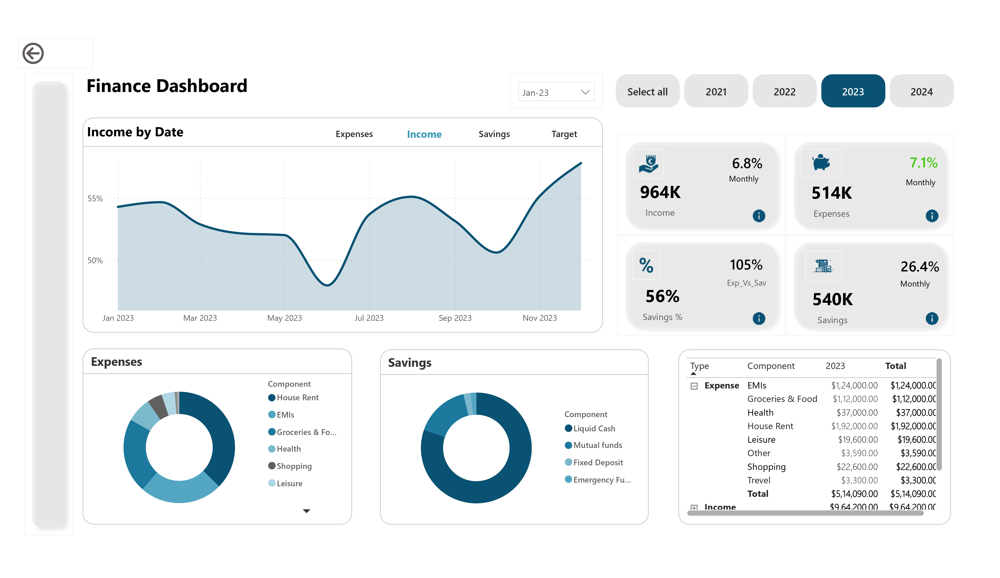
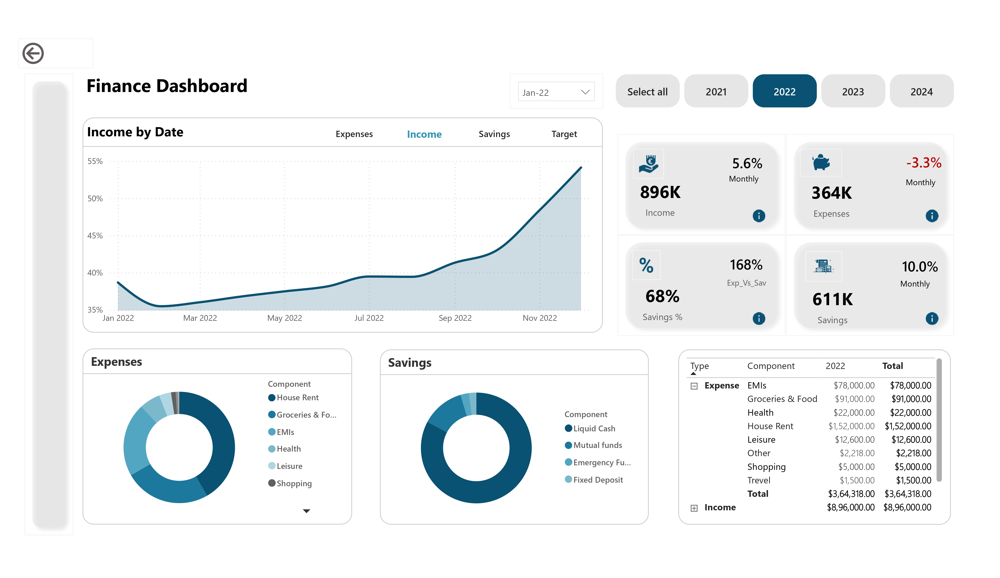

# 📊 Personal Finance Insights Dashboard

Finance isn’t just about numbers — it’s about behavior.

This Power BI dashboard was built to go beyond tracking cash flow. It extracts decision-level insights from personal finance data, transforming simple income and expense logs into behavioral narratives that drive better financial outcomes.

## 🔍 What I Discovered
- ✅ **Income increased** from ₹896K (2022) to ₹964K (2023), but **savings dropped** from 68% to 56%
- ✅ **Monthly expenses** rose 1.8%, driven by EMIs, shopping, and travel
- ✅ **Fixed costs** stayed flat, but **lifestyle spending** grew disproportionately
- ✅ Used **DAX** to calculate savings %, expense-to-savings ratios, and monthly variance
- ✅ Enabled **drill-downs** by year, category, and component (e.g. EMIs, groceries, rent)

## 💡 Key Insight
Higher income didn’t lead to higher savings — **behavioral inflation** did. EMIs and discretionary spending quietly eroded long-term profitability.

## 🧠 Data-Driven Profitability Strategy
- 🔹 Cap EMI exposure as a % of income
- 🔹 Track and analyze variance in discretionary spending
- 🔹 Reallocate surplus funds into yield-generating assets
- 🔹 Build dashboards that influence behavior, not just report numbers

## 🛠️ Tools & Techniques
- **Power BI** for dashboard creation
- **DAX** for custom calculations (savings %, expense ratios)
- **Interactive visuals** for drill-down and trend analysis
- **KPI Cards** to highlight income, expense, and savings shifts

## 🎯 Focus Areas
- Behavioral Finance
- Spend Analysis
- Profitability Tracking
- Personal Financial Health

---

## 📸 Sample Visuals

---

## 📎 File
- `Finance.pbix`: Power BI project file 

---

## 🧵 Let's Talk
Even small datasets can reveal powerful stories when modeled right. This dashboard was a reminder: insight isn’t in the data, it’s in how you use it.

